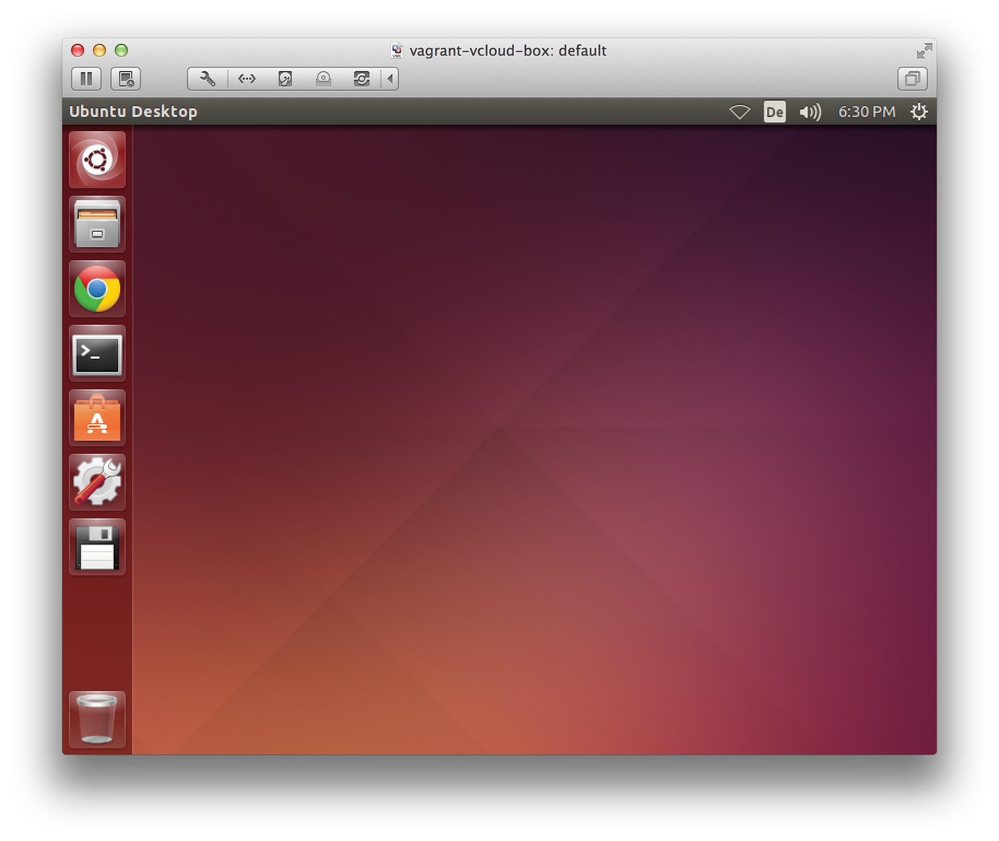

vagrant-vcloud-box
==================

Ubuntu Desktop box with preinstalled Vagrant and vagrant-vcloud plugin
to have a working environment to connect to vCloud.

## What's inside the box?

* Ubuntu 14.04 Desktop (with german keyboard and timezone)
* [Vagrant 1.7.2](http://vagrantup.com)
* [vagrant-vcloud 0.4.4](https://github.com/StefanScherer/vagrant-vcloud) Plugin to work with Vagrant in vCloud, special pre-release
* rdesktop for the [`vagrant rdp`](https://docs.vagrantup.com/v2/cli/rdp.html) command
* rsync to use the synced folder feature of Vagrant to transfer files into the vCloud guests.
* git to clone GitHub repos
* Google Chrome to connect to the vCloud Director web interface
* nodejs + npm to work with [grunt-jenkins](http://documentup.com/sghill/grunt-jenkins) to save/restore Jenkins servers that are also built with `vagrant up`



## Preparation

### SSH Keys

To clone private GitHub repos, you may place your SSH key here: 

```
resources/.ssh/id_rsa
resources/.ssh/id_rsa.pub
resources/.ssh/known_hosts
```

They will be copied into the box.

On a unix host, use the following commands to fill the resources with your SSH key from the host.

```bash
mkdir resources/.ssh
cp ~/.ssh/* resources/.ssh/
cp ~/.vagrant.d/Vagrantfile resources/
```

### Create a user vagrant in your vCloud org

It is strongly recommended to use another user than your normal Windows user account name to log into your vCloud from vagrant. Just to avoid entering your Windows password in this `Vagrantfile`.

So log into your vCloud org, go to Administration tab, then Users. Create an user `vagrant` there with local administration rights and a password.

### Global Vagrantfile

Your connection data into your vCloud org or other global Vagrant
settings could be placed in the following file:

```
resources/Vagrantfile
```

This file will be copied into `~/.vagrant.d/Vagrantfile` in the guest VM so that the `vagrant-vcloud` plugin can connect to your vCloud org from inside this VM.
Enter the user name and password of the newly created user of your vCloud org.

This file may look like this one:

```ruby
# -*- mode: ruby -*-
# vi: set ft=ruby :

Vagrant.configure("2") do |config|

  if Vagrant.has_plugin?("vagrant-vcloud")
    # vCloud Director provider settings
    config.vm.provider :vcloud do |vcloud|
      vcloud.hostname = "https://yourvcloudhost.fqdn"
      vcloud.username = "vagrant"
      vcloud.password = "XXXXXXX"

      vcloud.org_name = "XX"
      vcloud.vdc_name = "XX-ORG"

      vcloud.catalog_name = "Vagrant"

      vcloud.vdc_network_name = "XX-INTERNAL"

      vcloud.vdc_edge_gateway = "XX-EDGE"
      vcloud.vdc_edge_gateway_ip = "10.100.XX.X"
    end
  end

end
```


## Installation

Just create the box

```
vagrant up
```

While provisioning the desktop restarts once to finalize the Gnome Settings. As a last step some Serverspec tests run to check if provisioning worked correctly.

Then open a terminal and you may clone GitHub repos with Vagrantfiles ready to
rumble to your vCloud.

## Build a Virtual Appliance (OVA)

### Manually on OS X

To build a Virtual Appliance of this Vagrant box, use the script `buildova.sh` which builds the box, installs all software and tests the box with `vagrant-serverspec`.

See the `test/` directory with all the serverspec tests that will run before building the OVA.

```bash
./buildova.sh
```

If everything works fine and the tests run sucessfully, an OVA file `vagrant-vcloud-box.ova` is written into the current directory.

### Automated with Jenkins on Windows

The OVA for VMware is created automatically with a [Jenkins job](https://raw.githubusercontent.com/StefanScherer/basebox-slave/master/jenkins-configuration/vagrant-vcloud-box_vmware/config.xml) in my [basebox-slave](https://github.com/StefanScherer/basebox-slave) Jenkins build pipeline. The script for the build will be called with

```bash
bin\build.bat vagrant-vcloud-box_vmware
```

Jenkins also checks the output of the Serverspec tests and uploads the OVA to a intranet server.

## Sample vCloud walktrough

Clone the following small sample repo to build a vCloud vApp with two Ubuntu boxes.

```bash
git clone https://github.com/StefanScherer/vcloud-scenarios.git
cd vcloud-scenarios
cd precise32
vagrant up --provider=vcloud
```

## Build this box in vCloud

You may also build this box inside your vCloud.

For the `serverspec` test, be sure to remove old entries in your `~/.ssh/known_hosts` file. Otherwise all tests will fail.

Now build the vApp in your vCloud with

```
vagrant up --provider=vcloud
```

It also forwards the RDP port, the `xrdp` server is installed, but there is still work to make it work correctly.

